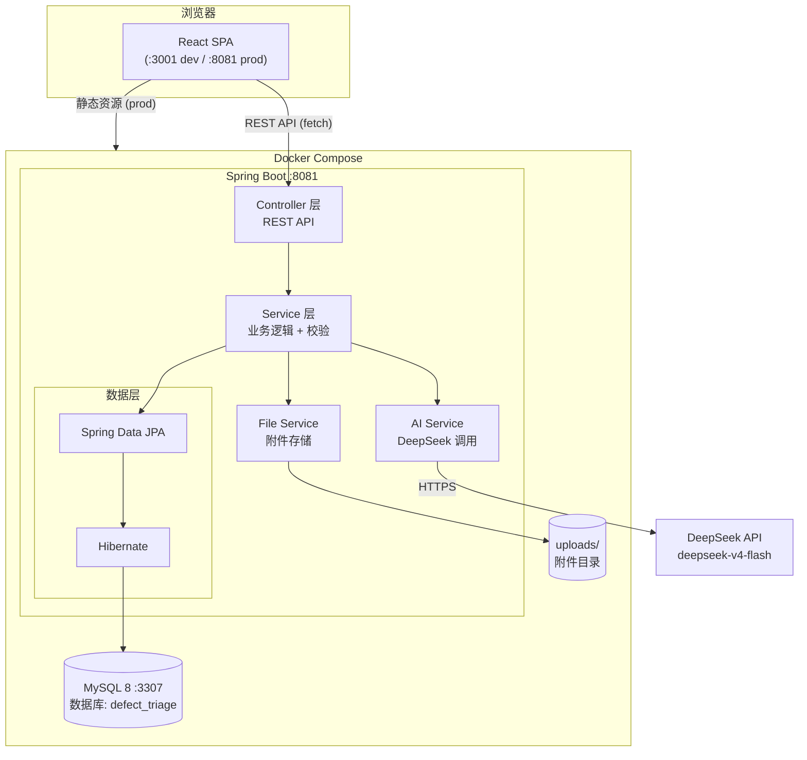
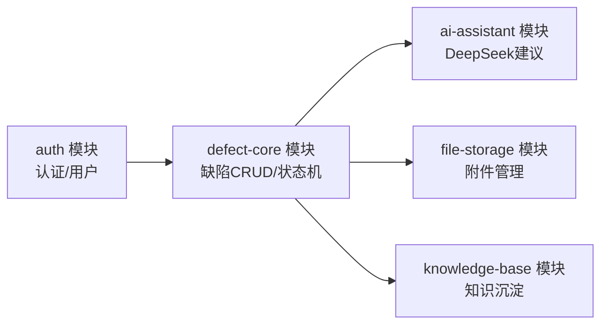
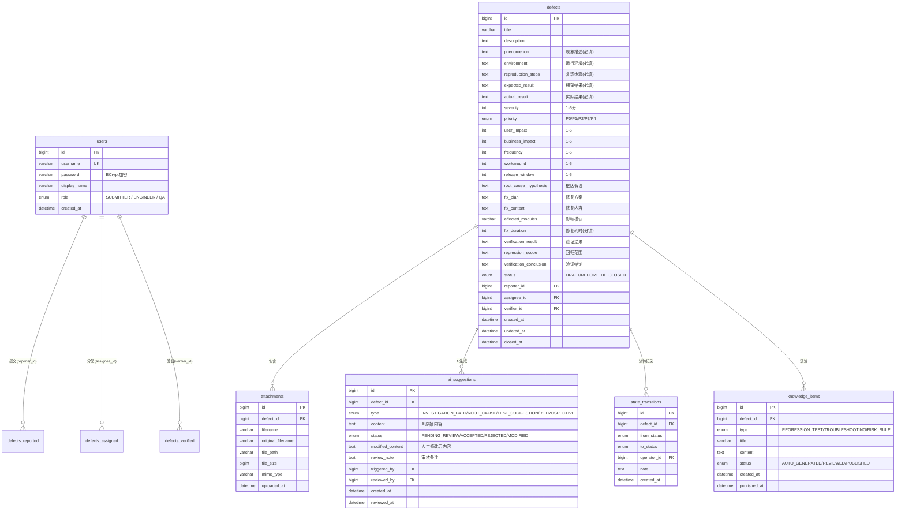
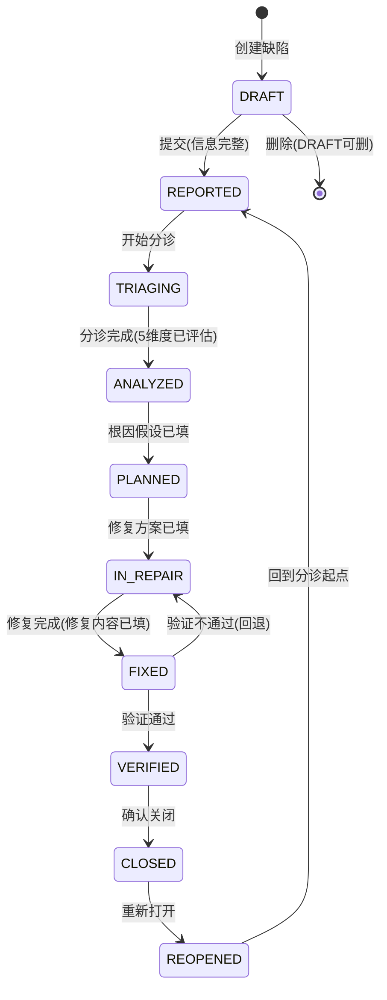

# 技术设计说明

## 1. 技术栈选择

| 类型      | 技术                        | 版本            | 选择原因                                     |
| --------- | --------------------------- | --------------- | -------------------------------------------- |
| 前端框架  | React + TypeScript          | React 19 / TS 6 | 模板项目已配置，shadcn/ui 组件生态成熟       |
| 前端构建  | Vite                        | 8.x             | 模板项目已配置，HMR 开发体验好               |
| 前端路由  | TanStack Router             | latest          | 模板项目已配置，类型安全的路由系统           |
| UI 组件库 | shadcn/ui                   | latest          | 模板项目已配置 button，按需添加其他组件      |
| 样式      | Tailwind CSS                | 4.x             | 模板项目已配置，与 shadcn/ui 深度集成        |
| 状态管理  | TanStack Query              | latest          | 模板项目已配置，服务端状态管理最佳方案       |
| 后端框架  | Spring Boot                 | 3.x             | 企业 Java 标准，生态完整，与 JDK 21 最佳兼容 |
| 后端语言  | Java                        | 21 LTS          | 最新 LTS，虚拟线程提升并发，本机已安装       |
| 构建工具  | Maven                       | 3.9             | 国内企业主流，资料丰富，本机已安装           |
| ORM       | Spring Data JPA + Hibernate | —               | 标准方案，自动建表（ddl-auto: update）       |
| 数据库    | MySQL                       | 8.x             | 企业标准，Docker 运行，本机已安装 Docker     |
| 认证      | jjwt (io.jsonwebtoken)      | 0.12.x          | 轻量级 JWT 库，无 Spring Security 的复杂度   |
| AI SDK    | OkHttp + Jackson            | —               | 直接 HTTP 调用 DeepSeek API，无需额外 SDK    |
| 文件存储  | 本地文件系统                | —               | 简单可靠，Docker 卷挂载持久化                |
| 后端测试  | JUnit 5 + MockMvc + H2      | —               | Spring Boot 标准测试栈，测试用 H2 内存库     |
| 前端测试  | Vitest                      | —               | Vite 生态标配                                |
| 部署      | Docker Compose              | —               | 一键编排 MySQL + 后端（含前端静态资源）      |

## 2. 架构设计

### 2.1 整体架构



### 2.2 分层职责

| 层         | 包路径          | 职责                                                 | 不做什么                             |
| ---------- | --------------- | ---------------------------------------------------- | ------------------------------------ |
| Controller | `controller/`   | 接收 HTTP 请求，参数校验，调用 Service，返回响应 DTO | 不写业务逻辑，不直接操作数据库       |
| Service    | `service/`      | 业务逻辑、状态校验、事务管理、AI 调用编排            | 不处理 HTTP 请求/响应                |
| Repository | `repository/`   | 数据库 CRUD，自定义查询                              | 不写业务逻辑                         |
| Entity     | `entity/`       | JPA 实体定义，与数据库表映射                         | 不写业务方法（除简单 getter/setter） |
| DTO        | `dto/`          | 前端交互对象，请求/响应格式                          | 不包含业务逻辑                       |
| Config     | `config/`       | JWT 过滤器、CORS 配置、WebMvc 配置                   | —                                    |
| AI         | `service/ai/`   | DeepSeek API 调用、Prompt 模板、响应解析             | 不直接对接 Controller                |
| File       | `service/file/` | 文件保存、读取、删除、校验                           | 不处理业务逻辑                       |

### 2.3 模块依赖关系



**模块间通信：** 模块间通过 Java Service 接口调用，不是 HTTP。每个模块可独立编写和运行单元测试。

## 3. 数据模型

### 3.1 ER 图



### 3.2 实体关系说明

| 关系                      | 基数 | 说明                               |
| ------------------------- | ---- | ---------------------------------- |
| User → Defect (reporter)  | 1:N  | 一个用户可以提交多个缺陷           |
| User → Defect (assignee)  | 1:N  | 一个 Engineer 可以负责多个缺陷     |
| User → Defect (verifier)  | 1:N  | 一个 QA 可以验证多个缺陷           |
| Defect → Attachment       | 1:N  | 一个缺陷可有最多 5 个附件          |
| Defect → AI Suggestion    | 1:N  | 一个缺陷在不同阶段生成多条 AI 建议 |
| Defect → State Transition | 1:N  | 审计日志，完整记录流转历史         |
| Defect → Knowledge Item   | 1:N  | 一个缺陷沉淀出多条知识条目         |

### 3.3 DDL 说明

- Hibernate 配置 `spring.jpa.hibernate.ddl-auto=update` 自动建表
- 预置数据通过 `data.sql` 在启动时插入
- 不需要手动建表，但需确保 MySQL 数据库 `defect_triage` 已存在

## 4. 接口 / 模块设计

### 4.1 后端模块

#### 4.1.1 auth — 认证与用户模块

| 接口     | 方法 | 路径               | 认证 | 说明                     |
| -------- | ---- | ------------------ | ---- | ------------------------ |
| 注册     | POST | /api/auth/register | 否   | 创建新用户（角色三选一） |
| 登录     | POST | /api/auth/login    | 否   | 返回 JWT token           |
| 当前用户 | GET  | /api/auth/me       | 是   | 返回当前登录用户信息     |

**JWT 设计：**

- Token 有效期：24 小时
- 载荷：`{ sub: userId, role: "ENGINEER", iat, exp }`
- 存储：前端 localStorage
- 校验：自定义 OncePerRequestFilter 拦截除 `/api/auth/**` 外的所有请求

**预置账号：**
| 用户名 | 密码 | 角色 | 显示名 |
|---|---|---|---|
| submitter | admin123 | SUBMITTER | 张三(提交人) |
| engineer | admin123 | ENGINEER | 李四(工程师) |
| qa | admin123 | QA | 王五(QA) |

#### 4.1.2 defect-core — 缺陷核心模块

| 接口     | 方法   | 路径                         | 角色               | 说明                                    |
| -------- | ------ | ---------------------------- | ------------------ | --------------------------------------- |
| 列表     | GET    | /api/defects                 | 所有               | 返回全部缺陷列表，支持 ?status=xxx 筛选 |
| 详情     | GET    | /api/defects/{id}            | 所有               | 含关联附件和 AI 建议                    |
| 创建     | POST   | /api/defects                 | 所有               | 状态初始为 DRAFT                        |
| 更新     | PUT    | /api/defects/{id}            | SUBMITTER/ENGINEER | 更新可编辑字段（取决于当前状态）        |
| 删除     | DELETE | /api/defects/{id}            | SUBMITTER          | 仅 DRAFT 状态可删除                     |
| 状态流转 | PATCH  | /api/defects/{id}/transition | ENGINEER/QA        | 参数: `?to=XXX`，后端校验流转合法性     |

**状态流转校验矩阵（PATCH /api/defects/{id}/transition）：**

| 当前状态  | 允许流转到 | 操作角色  | 额外校验条件                     |
| --------- | ---------- | --------- | -------------------------------- |
| DRAFT     | REPORTED   | SUBMITTER | 6 个必填字段已填                 |
| REPORTED  | TRIAGING   | ENGINEER  | —                                |
| TRIAGING  | ANALYZED   | ENGINEER  | 5 个评估维度已打分               |
| ANALYZED  | PLANNED    | ENGINEER  | 根因假设已填写                   |
| PLANNED   | IN_REPAIR  | ENGINEER  | 修复方案已填写                   |
| IN_REPAIR | FIXED      | ENGINEER  | 修复内容已填写                   |
| FIXED     | VERIFIED   | QA        | 验证记录（结果/范围/结论）已填写 |
| FIXED     | IN_REPAIR  | QA        | 验证不通过时回退                 |
| VERIFIED  | CLOSED     | QA        | —                                |
| CLOSED    | REOPENED   | ENGINEER  | —                                |
| REOPENED  | REPORTED   | ENGINEER  | —                                |

#### 4.1.3 ai-assistant — AI 辅助模块

| 接口         | 方法 | 路径                             | 角色     | 说明                           |
| ------------ | ---- | -------------------------------- | -------- | ------------------------------ |
| 获取 AI 建议 | GET  | /api/defects/{id}/ai-suggestions | 所有     | 返回该缺陷的所有 AI 建议列表   |
| 手动刷新建议 | POST | /api/defects/{id}/ai-suggestions | ENGINEER | 重新生成当前状态对应的 AI 建议 |
| 审核建议     | PUT  | /api/ai-suggestions/{id}/review  | ENGINEER | 采纳/拒绝/修改                 |

**AI 触发生命周期（按需同步生成）：**

AI 建议在 `GET /api/defects/{id}/ai-suggestions` 被调用时按需同步生成，而非在流转时异步触发。查询时若当前状态缺少对应类型的建议，则同步调用 DeepSeek 生成并等待返回。

| 当前状态   | 自动生成的建议类型             | 说明                   |
| ---------- | ------------------------------ | ---------------------- |
| TRIAGING   | INVESTIGATION_PATH（排查路径） | 基于现象/环境/复现步骤 |
| ANALYZED   | ROOT_CAUSE（根因假设）         | 基于排查结果和影响评估 |
| PLANNED    | FIX_PLAN（修复计划建议）       | 基于根因假设和影响范围 |
| IN_REPAIR  | FIX_CONTENT（修复内容建议）    | 基于修复方案           |
| FIXED      | TEST_SUGGESTION（测试建议）    | 基于修复内容和影响模块 |
| CLOSED     | RETROSPECTIVE（复盘草稿）      | 基于完整缺陷记录       |

**DeepSeek API 调用规格：**

- Endpoint: `https://api.deepseek.com/v1/chat/completions`
- Model: `deepseek-v4-flash`
- API Key: `sk-b28baac32f224155bbe69844264c4ec3`（配置在 application.properties）
- 请求超时：60 秒
- 失败重试：3 次（间隔 2 秒）
- 连接超时：30 秒
- 响应格式: 要求 AI 以结构化 Markdown 返回，后端解析为纯文本存储

**Prompt 模板（以排查路径为例）：**

```
你是一名资深 FSE 工程师。请根据以下缺陷信息，生成结构化的排查路径建议。

缺陷标题：{title}
现象描述：{phenomenon}
运行环境：{environment}
复现步骤：{reproduction_steps}
期望结果：{expected_result}
实际结果：{actual_result}

请按以下格式输出：
## 可能原因分析
（列出 2-3 个可能原因，按可能性从高到低排列）
## 排查步骤
（按优先级列出具体排查步骤，每步说明目的和方法）
## 推荐工具
（列出排查中建议使用的工具或命令）
```

#### 4.1.4 file-storage — 附件存储模块

| 接口         | 方法   | 路径                           | 角色      | 说明                           |
| ------------ | ------ | ------------------------------ | --------- | ------------------------------ |
| 获取附件列表 | GET    | /api/defects/{id}/attachments  | 所有      | 返回附件元数据列表             |
| 上传附件     | POST   | /api/defects/{id}/attachments  | 所有      | multipart/form-data，最多 5 个 |
| 下载附件     | GET    | /api/attachments/{id}/download | 所有      | 返回文件流                     |
| 删除附件     | DELETE | /api/attachments/{id}          | SUBMITTER | 仅附件上传者可删除             |

**文件校验规则：**

- 允许类型: image/png, image/jpeg, image/gif, image/webp, text/plain, application/pdf
- 单文件最大: 5MB
- 每个缺陷最多: 5 个附件
- 存储路径: `./uploads/{defectId}/{uuid}_{filename}`
- 存储方式: 数据库存元数据（filename, file_path, file_size, mime_type），文件系统存实际文件

#### 4.1.5 knowledge-base — 知识库模块

| 接口     | 方法 | 路径                        | 角色     | 说明                                |
| -------- | ---- | --------------------------- | -------- | ----------------------------------- |
| 知识列表 | GET  | /api/knowledge              | 所有     | 支持 ?type=xxx&keyword=xxx 筛选搜索 |
| 知识详情 | GET  | /api/knowledge/{id}         | 所有     | 包含关联的原始缺陷摘要              |
| 发布     | PUT  | /api/knowledge/{id}/publish | ENGINEER | 将 AUTO_GENERATED → PUBLISHED       |
| 编辑内容 | PUT  | /api/knowledge/{id}         | ENGINEER | 修改标题或内容后发布                |

**知识条目生成规则（缺陷 CLOSED 时自动触发）：**

| 知识类型                    | 生成依据                               | 说明                     |
| --------------------------- | -------------------------------------- | ------------------------ |
| REGRESSION_TEST（回归用例） | 现象 + 验证结果 + 修复内容             | 生成可复用的回归测试场景 |
| TROUBLESHOOTING（排查手册） | 根因假设 + 排查路径 AI 建议 + 修复方案 | 合成最终的排查步骤       |
| RISK_RULE（风险规则）       | 影响评估 + 优先级 + 影响模块           | 提炼为风险检查规则       |

### 4.2 前端模块

#### 4.2.1 路由设计

| 路径            | 页面组件            | 说明                    | 权限     |
| --------------- | ------------------- | ----------------------- | -------- |
| /login          | LoginPage           | 登录表单                | 公开     |
| /register       | RegisterPage        | 注册表单                | 公开     |
| /               | DefectListPage      | 缺陷看板/列表（默认页） | 登录用户 |
| /defects/new    | DefectCreatePage    | 创建新缺陷              | 登录用户 |
| /defects/{id}   | DefectDetailPage    | 缺陷详情 + AI 审核面板  | 登录用户 |
| /knowledge      | KnowledgePage       | 知识库列表              | 登录用户 |
| /knowledge/{id} | KnowledgeDetailPage | 知识条目详情            | 登录用户 |

#### 4.2.2 组件树

```
App
├── LoginPage
│   └── LoginForm
├── RegisterPage
│   └── RegisterForm
├── DefectListPage
│   ├── DefectFilters (状态筛选 + 搜索)
│   ├── DefectTable (TanStack Table 客户端分页)
│   │   └── DefectRow (单行：标题/状态/优先级/负责人/时间)
│   └── CreateDefectButton
├── DefectCreatePage
│   └── DefectForm
│       ├── BasicInfoSection (标题/描述)
│       ├── ReproductionSection (现象/环境/复现步骤/期望/实际)
│       └── AttachmentUpload
├── DefectDetailPage
│   ├── DefectInfoPanel (左侧主面板)
│   │   ├── StatusBadge (当前状态)
│   │   ├── DefectMetadata (各阶段信息，可编辑)
│   │   ├── TransitionButton (状态流转按钮)
│   │   ├── AttachmentList
│   │   └── TransitionTimeline (流转历史)
│   └── AISuggestionPanel (右侧 AI 面板)
│       ├── SuggestionCard (每条 AI 建议)
│       │   ├── SuggestionContent (AI 原文)
│       │   ├── ReviewActions (采纳/拒绝/修改按钮)
│       │   └── ReviewStatus (审核状态标签)
│       └── RefreshButton (手动刷新)
├── KnowledgePage
│   ├── KnowledgeFilters (类型筛选 + 搜索)
│   └── KnowledgeList
└── KnowledgeDetailPage
    └── KnowledgeContent (关联缺陷链接)
```

#### 4.2.3 状态管理

| 数据类型    | 管理方式                    | 说明                               |
| ----------- | --------------------------- | ---------------------------------- |
| 当前用户    | React Context               | 登录后存入，全局组件可消费角色信息 |
| JWT Token   | localStorage                | 持久化，页面刷新后保持登录         |
| 缺陷列表    | TanStack Query (`useQuery`) | 服务端数据，自动缓存和更新         |
| 缺陷详情    | TanStack Query (`useQuery`) | 按 ID 获取                         |
| AI 建议列表 | TanStack Query (`useQuery`) | 与缺陷详情关联刷新                 |
| 知识列表    | TanStack Query (`useQuery`) | 支持筛选参数                       |

## 5. 状态流转设计

### 5.1 状态机图



### 5.2 流转实现方案

后端 `DefectService.transition(defectId, targetStatus, userId)` 方法：

```java
// 伪代码
1. 获取当前缺陷
2. 获取当前用户角色
3. 查询状态流转规则表（VALID_TRANSITIONS）
4. 校验：当前状态 → 目标状态 是否在允许列表中
5. 校验：用户角色是否匹配
6. 校验：目标状态的额外条件是否满足（如必填字段）
7. 校验不通过 → 抛出 BusinessException(错误信息)
8. 通过 → 更新 status，记录 state_transitions 审计日志
9. 如果进入特定状态 → 异步触发 AI 建议生成
10. 如果进入 CLOSED → 异步触发知识条目生成
```

## 6. 关键业务规则实现

### 6.1 复现信息先于修复

**实现位置：** `DefectService.validateRequiredFields(defect)`

当流转到 REPORTED 时：

```java
List<String> missingFields = new ArrayList<>();
if (isBlank(defect.getPhenomenon())) missingFields.add("现象描述");
if (isBlank(defect.getEnvironment())) missingFields.add("运行环境");
if (isBlank(defect.getReproductionSteps())) missingFields.add("复现步骤");
if (isBlank(defect.getExpectedResult())) missingFields.add("期望结果");
if (isBlank(defect.getActualResult())) missingFields.add("实际结果");
if (!missingFields.isEmpty()) {
    throw BusinessException.of("缺少必填信息: " + String.join(", ", missingFields));
}
```

### 6.2 影响判断先于优先级

**实现位置：** `DefectService.calculatePriority(defect)`

当流转 TRIAGING → ANALYZED 时：

```java
// 1. 校验 5 个评估维度均已打分（1-5）
// 2. 计算加权得分（不足则抛出异常）
//    用户影响×0.3 + 业务影响×0.3 + 频率×0.2 + 规避方案×0.1 + 发布窗口×0.1
// 3. 映射到优先级: 4.5-5.0→P0, 3.5-4.4→P1, 2.5-3.4→P2, 1.5-2.4→P3, <1.5→P4
// 4. 人工可在 ANALYZED 阶段覆盖自动计算值
```

### 6.3 验证先于关闭

**实现位置：** `DefectService.transition()` 中对 FIXED → VERIFIED 和 VERIFIED → CLOSED 的校验

```java
// FIXED → VERIFIED: 校验 verificationResult, regressionScope, verificationConclusion
// VERIFIED → CLOSED: 校验 verifier 角色为 QA
// 任一校验失败 → 抛出 BusinessException
```

### 6.4 人负责判断，Agent 负责辅助

**实现位置：** `AISuggestionService` + 前端审核面板

- 所有 AI 建议初始状态为 `PENDING_REVIEW`
- 前端在 AI 面板中以橙色标签标记未审核建议
- 工程师必须对每条建议执行：采纳/拒绝/修改
- 审核记录持久化到 `ai_suggestions` 表
- 建议被拒绝时，必填 `review_note` 说明拒绝原因

### 6.5 交付后沉淀知识

**实现位置：** `KnowledgeService.generateForDefect(defect)` (缺陷 CLOSED 时异步触发)

```java
// 1. 基于验证结果 + 修复内容 → 生成回归测试用例
// 2. 基于根因假设 + AI排查建议 → 合成排查手册
// 3. 基于影响评估 + 优先级 + 影响模块 → 提炼风险规则
// 4. 状态为 AUTO_GENERATED，人工审核后可 PUBLISHED
```

## 7. 错误处理与边界处理

### 7.1 后端全局异常处理

| 异常类型                  | HTTP 状态码 | 返回体                           | 触发场景                               |
| ------------------------- | ----------- | -------------------------------- | -------------------------------------- |
| BusinessException         | 400         | `{ error: "xxx" }`               | 业务规则违反（状态不可流转、必填缺失） |
| UnauthorizedException     | 401         | `{ error: "未登录" }`            | Token 缺失或过期                       |
| ForbiddenException        | 403         | `{ error: "无权限" }`            | 角色不匹配                             |
| EntityNotFoundException   | 404         | `{ error: "缺陷不存在" }`        | ID 对应的资源不存在                    |
| FileSizeExceededException | 413         | `{ error: "文件过大" }`          | 文件超过 5MB                           |
| AITimeoutException        | 503         | `{ error: "AI 服务暂时不可用" }` | DeepSeek 超时                          |
| 其他 RuntimeException     | 500         | `{ error: "服务器内部错误" }`    | 未预期的运行时错误                     |

### 7.2 前端错误处理

- TanStack Query 的 `onError` 回调统一处理 API 错误
- 401 → 清除 token，跳转登录页
- 400/403 → Toast 提示具体错误信息
- 500/503 → Toast 通用错误提示
- 网络错误（fetch fail）→ Toast "网络连接失败"

### 7.3 边界场景

| 场景                     | 处理方式                                                     |
| ------------------------ | ------------------------------------------------------------ |
| MySQL 连接失败           | 应用启动失败，控制台输出 "无法连接MySQL，请确认Docker已启动" |
| DeepSeek API Key 无效    | AI 建议返回"AI 服务配置错误"，不阻塞主流程                   |
| DeepSeek 返回非预期 JSON | 容错：将原始返回作为纯文本 AI 建议存储                       |
| 上传文件数超过 5 个      | 后端返回 400，提示 "每个缺陷最多 5 个附件"                   |
| 并发流转同一缺陷         | 数据库乐观锁（@Version），后来者返回"缺陷已被修改，请刷新"   |
| 用户删除已关闭的缺陷     | 不允许，CLOSED 状态不可删除                                  |
| 文件上传到一半的临时文件 | 上传失败不记录数据库，定期清理 uploads 下的临时文件          |

## 8. 前端开发说明

### 8.1 开发环境

- 开发阶段: `cd templates/frontend && npm run dev` → localhost:3000
- Vite proxy 配置: `/api/**` → `http://localhost:8080`
- 最终部署: `npm run build` → 产物复制到 Spring Boot `src/main/resources/static/`

### 8.2 shadcn/ui 需要添加的组件

```bash
npx shadcn add card table dialog form input textarea select badge tabs separator scroll-area toast tooltip dropdown-menu avatar
```

### 8.3 前端对后端的状态映射

前端的 TanStack Router 路径参数与后端 API 对应，不维护独立的前端状态机——所有状态流转由后端校验并返回最新状态。

## 9. Docker Compose 部署设计

```yaml
# docker-compose.yml (草案)
services:
  mysql:
    image: mysql:8.0
    environment:
      MYSQL_ROOT_PASSWORD: root123
      MYSQL_DATABASE: defect_triage
    ports:
      - "3306:3306"
    volumes:
      - mysql_data:/var/lib/mysql
      - ./sql/init.sql:/docker-entrypoint-initdb.d/init.sql

  app:
    build: ./backend
    ports:
      - "8080:8080"
    environment:
      SPRING_DATASOURCE_URL: jdbc:mysql://mysql:3306/defect_triage
      SPRING_DATASOURCE_USERNAME: root
      SPRING_DATASOURCE_PASSWORD: root123
      DEEPSEEK_API_KEY: sk-b28baac32f224155bbe69844264c4ec3
    volumes:
      - uploads_data:/app/uploads
    depends_on:
      - mysql

volumes:
  mysql_data:
  uploads_data:
```

## 10. AI 参与技术设计的情况

| 设计模块            | 由谁完成         | 说明                                                 |
| ------------------- | ---------------- | ---------------------------------------------------- |
| 整体架构分层        | AI 建议 + 人调整 | AI 建议标准 Spring Boot 分层，人补充了模块独立性要求 |
| 数据库 ER 图        | AI 生成          | 基于需求文档中的业务对象自动推导                     |
| 状态流转矩阵        | 人设计 + AI 校验 | 核心业务规则由人定义，AI 检查流转图的完整性          |
| AI Prompt 模板      | 人设计           | 需要理解缺陷工程的实际排查流程                       |
| Docker Compose 部署 | AI 生成初稿      | 人调整了卷挂载和环境变量配置                         |
